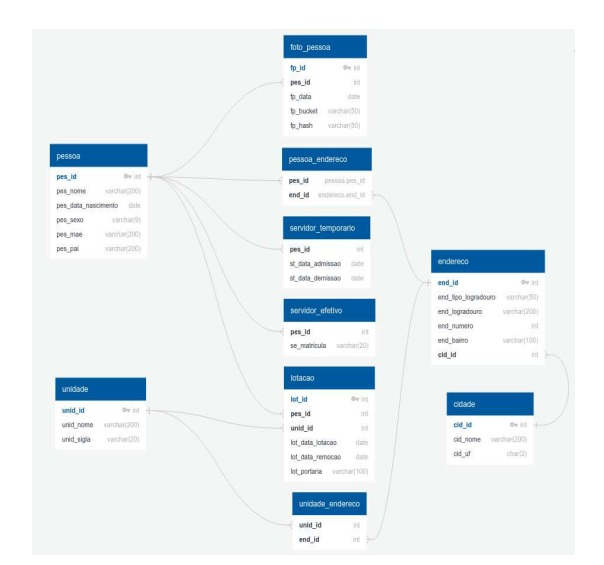

# **Projeto Spring Boot com PostgreSQL, MinIO e Docker Compose**

## **Tecnologias Utilizadas**
* Spring Boot: Framework Java para construção da aplicação backend.
* PostgreSQL: Banco de dados relacional.
* PgAdmin: Interface gráfica para gerenciamento do PostgreSQL.
* Docker Compose: Ferramenta para definir e rodar aplicativos multi-containers (PostgreSQL, PgAdmin e MinIO).
* JWT: Autenticação baseada em JSON Web Tokens.
* MinIO: Serviço de armazenamento de objetos para upload de imagens.

## **Estrutura do Projeto**

### Configuração do Spring Boot Initializr: 
O projeto foi inicializado através do Spring Boot Initializr com as seguintes dependências:

* Spring Web
* Spring Data JPA
* Spring Security
* PostgreSQL Driver
* Lombok
* Spring Boot DevTools
* JWT (dependência para autenticação)
 
### Configuração do Docker Compose 
O Docker Compose foi configurado para rodar três containers:

* PostgreSQL: Banco de dados relacional.
* PgAdmin: Interface para facilitar o gerenciamento do PostgreSQL.
* MinIO: Serviço de armazenamento de objetos para upload de imagens.

O arquivo docker-compose.yml configura todos os containers necessários, incluindo as credenciais de acesso ao MinIO.

Diagrama de Classes: As classes foram criadas conforme o diagrama de classes a seguir:

## Execução

1. [x] `docker-compose up -d`
   * ✅ Iniciará um PostgreSQL na porta 5432 com banco e usuário configurados.

   * ✅ Iniciará um MinIO na porta 9000 e o painel de administração na 9001.

2. [x] Acessar o MinIO

   * http://localhost:9000
   * **Usuário**: admin
   * **Senha**: admin123

3. [x] Crie um bucket para armazenar os objetos S3.